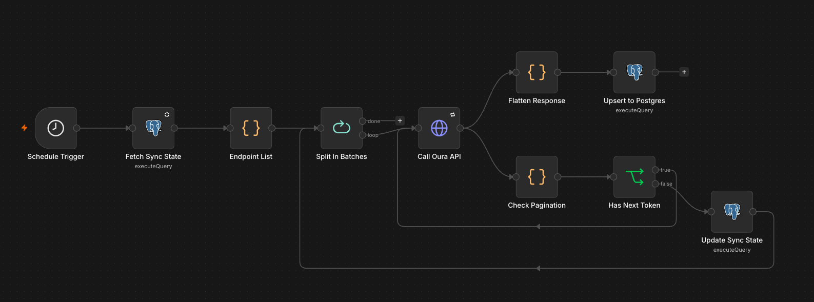

# n8n-Oura-Ring-to-Postgres-Data-Pipeline

I had a difficult time finding any information out there to connect n8n into Oura's Developer API. There's a standard n8n connector for rolled up data however, I wanted to pull down all endpoints. The below is a write up via Claude for getting your connection setup. 



---

# Oura Ring → n8n → Postgres: Full Data Pipeline

A self-hosted n8n workflow that pulls the *complete* Oura v2 dataset (not just the
summary metrics the built-in n8n Oura node exposes), lands it raw in Postgres, and
backfills automatically if a scheduled run is ever missed.

---

## 1. Why this exists

n8n's built-in Oura node only covers profile info + three daily summaries
(activity/readiness/sleep). The full Oura v2 API has ~20 endpoints (sleep detail,
heart rate, workouts, sessions, SpO2, stress, resilience, tags, ring telemetry,
etc.), and no ready-made n8n template covers all of them — this is a hand-built
`HTTP Request` + `Postgres` pipeline instead.

**Architecture, in one line:** Schedule Trigger → read last sync checkpoint per
endpoint → loop over ~19 endpoints → call Oura (with pagination) → land raw JSON in
Postgres → advance checkpoint → repeat for next endpoint.

---

## 2. Prerequisites

- Self-hosted n8n, reachable from the public internet for the one-time OAuth
  consent step (a Cloudflare Tunnel or similar works fine).
- A Postgres database for your **own data** — separate from n8n's internal
  database. n8n's internal DB is private infrastructure state (workflows,
  credentials, execution logs); don't mix your data into it. This should ideally
  be the same Postgres your BI/dbt tooling already points at.
- An Oura account with an active ring.

> **Personal Access Tokens are dead.** Oura deprecated PATs in December 2025.
> OAuth2 is the only path for new integrations now.

---

## 3. Step 1 — Register an OAuth2 app with Oura

1. Go to `developer.ouraring.com/applications` and create a new application.
2. You'll need a redirect URI. n8n will show you the exact one to use once you
   create the credential in Step 4 (something like
   `https://your-n8n-domain/rest/oauth2-credential/callback`) — copy it in
   **exactly**, character for character, once you have it. A mismatch here is the
   #1 cause of OAuth failures with self-hosted n8n behind a tunnel.
3. You'll also need placeholder privacy policy / terms of service URLs to satisfy
   the registration form — fine to use simple placeholder pages for a personal
   project.
4. Save the app. Oura gives you a **Client ID** and **Client Secret** — keep these
   handy for Step 4. Don't put them in the workflow JSON (see the security note in
   Step 4).

---

## 4. Step 2 — Create the Oura OAuth2 credential in n8n

**Important:** the client ID/secret go into n8n's **Credentials** tab (Settings →
Credentials → New), never into a workflow node or the workflow JSON. The workflow
only ever references a credential by name — the secret itself stays in n8n's
encrypted credential store. This also means it's safe to share the workflow JSON
file (Section 7) with a peer without leaking anything.

1. Settings → Credentials → New → **OAuth2 API**.
2. Fill in:
   - **Authorization URL**: `https://cloud.ouraring.com/oauth/authorize`
   - **Access Token URL**: `https://api.ouraring.com/oauth/token`
   - **Client ID / Client Secret**: from Step 3
   - **Scope** (space-separated):
     ```
     email personal daily heartrate workout session tag spo2 ring_configuration heart_health
     ```
     (`heart_health` specifically gates `vO2_max` and `daily_cardiovascular_age` —
     without it those two endpoints 401.)
3. Copy the **OAuth Redirect URL** n8n shows on this screen into your Oura app's
   Redirect URI field (back in the developer portal), if you haven't already.
4. Click **"Connect my account"** and complete the consent flow on Oura's site.
5. Name the credential something clear, e.g. `Oura OAuth2 API`. Save.

### Troubleshooting this step

| Symptom | Likely cause | Fix |
|---|---|---|
| "Unauthorized" immediately on clicking Connect, never see Oura's screen | Wrong client ID, or app not saved on Oura's side | Re-check the client ID; confirm the app exists in the developer portal |
| "Unauthorized" *after* approving on Oura's screen, on redirect back to n8n | Client authentication method mismatch — Oura needs the client secret sent either in the request body or via HTTP Basic Auth, and n8n has a toggle for which | In the credential form, find the **Authentication** (or **Client authentication**) field and toggle between **Body** and **Header**. Also check for a stray trailing newline if you pasted the secret in. |
| n8n's shown "OAuth Redirect URL" doesn't match your tunnel domain | n8n's `WEBHOOK_URL` / `N8N_HOST` / `N8N_PROTOCOL` env vars aren't set to your actual public tunnel URL | Set those env vars to your real `https://` tunnel domain so n8n generates the correct callback URL |
| Cloudflare tunnel URL keeps changing | Using a "Quick Tunnel" (`trycloudflare.com`), which is randomly assigned per restart | Use a named tunnel with a fixed public hostname instead |

---

## 5. Step 3 — Postgres setup

Run this once, in **your analytics database** (not n8n's internal one):

```sql
-- Raw landing table: one row per Oura document, per endpoint.
-- Deliberately schema-flexible (jsonb payload) since ~19 endpoints all
-- return different shapes — shape it downstream in dbt/Lightdash instead
-- of hand-mapping 19 different table schemas here.
CREATE TABLE oura_raw (
    endpoint TEXT NOT NULL,
    document_id TEXT NOT NULL,
    day DATE,
    payload JSONB NOT NULL,
    fetched_at TIMESTAMPTZ NOT NULL DEFAULT now(),
    PRIMARY KEY (endpoint, document_id)
);

-- Checkpoint table: tracks the last successfully-synced date per endpoint,
-- so a missed run (or several) doesn't lose data — see Section 8.
CREATE TABLE oura_sync_state (
    endpoint TEXT PRIMARY KEY,
    last_synced_through DATE NOT NULL
);
```

Then, Settings → Credentials → New → **Postgres** in n8n, using your database
host/port/database name/user/password. Name it something like `Analytics
Postgres`.

---

## 6. Step 4 — Import the workflow

Workflows → Import from File → select `oura_full_data_pipeline.json` (Section 7
below). It imports with placeholder credential references — you then need to:

1. Open **"Call Oura API"** → set its credential dropdown to your `Oura OAuth2
   API` credential.
2. Open each of the three Postgres nodes (**"Fetch Sync State"**, **"Upsert to
   Postgres"**, **"Update Sync State"**) → set each to your `Analytics Postgres`
   credential.
3. On **"Fetch Sync State"**, open node settings and enable **"Always Output
   Data"** — on the very first run `oura_sync_state` is empty, and a
   zero-row query result otherwise halts the workflow right there instead of
   flowing through to the endpoint list. (The Endpoint List code already handles
   an empty checkpoint gracefully — it just needs the empty result to actually
   reach it.)
4. Save. Do one manual "Execute workflow" run before trusting the schedule.

---

## 7. The workflow JSON

Save this as `oura_full_data_pipeline.json` and import it as described above.

```json
{
  "name": "Oura Full Data Pipeline",
  "nodes": [
    {
      "parameters": {
        "rule": {
          "interval": [
            { "field": "cronExpression", "expression": "0 3 * * *" }
          ]
        }
      },
      "id": "schedule-trigger",
      "name": "Schedule Trigger",
      "type": "n8n-nodes-base.scheduleTrigger",
      "typeVersion": 1.2,
      "position": [0, 300]
    },
    {
      "parameters": {
        "operation": "executeQuery",
        "query": "SELECT endpoint, last_synced_through FROM oura_sync_state;",
        "options": {}
      },
      "id": "fetch-sync-state",
      "name": "Fetch Sync State",
      "type": "n8n-nodes-base.postgres",
      "typeVersion": 2.5,
      "position": [220, 300],
      "credentials": {
        "postgres": { "id": "REPLACE_WITH_YOUR_POSTGRES_CREDENTIAL_ID", "name": "Postgres account" }
      }
    },
    {
      "parameters": {
        "mode": "runOnceForAllItems",
        "jsCode": "// How many days to re-pull on every run, to catch Oura data that syncs late.\nconst overlapDays = 3;\n// How far back to go on the very first run for an endpoint (no checkpoint yet).\nconst initialBackfillDays = 30;\n\nconst today = new Date();\nconst todayStr = today.toISOString().slice(0, 10);\n\nconst syncRows = $input.all().map(i => i.json);\nconst syncMap = {};\nfor (const row of syncRows) {\n  syncMap[row.endpoint] = row.last_synced_through;\n}\n\nconst endpoints = [\n  { endpoint: 'personal_info', dateType: 'none' },\n  { endpoint: 'daily_activity', dateType: 'date' },\n  { endpoint: 'daily_readiness', dateType: 'date' },\n  { endpoint: 'daily_sleep', dateType: 'date' },\n  { endpoint: 'daily_spo2', dateType: 'date' },\n  { endpoint: 'daily_stress', dateType: 'date' },\n  { endpoint: 'daily_resilience', dateType: 'date' },\n  { endpoint: 'daily_cardiovascular_age', dateType: 'date' },\n  { endpoint: 'vO2_max', dateType: 'date' },\n  { endpoint: 'sleep', dateType: 'date' },\n  { endpoint: 'sleep_time', dateType: 'date' },\n  { endpoint: 'workout', dateType: 'date' },\n  { endpoint: 'session', dateType: 'date' },\n  { endpoint: 'tag', dateType: 'date' },\n  { endpoint: 'enhanced_tag', dateType: 'date' },\n  { endpoint: 'rest_mode_period', dateType: 'date' },\n  { endpoint: 'ring_configuration', dateType: 'date' },\n  { endpoint: 'heartrate', dateType: 'datetime' },\n  { endpoint: 'ring_battery_level', dateType: 'datetime' }\n  // 'interbeat_interval' removed: gated behind a research-access tier,\n  // not unlockable via standard OAuth scopes for individual developer apps.\n];\n\nreturn endpoints.map(e => {\n  let startDateObj;\n  const checkpoint = syncMap[e.endpoint];\n  if (checkpoint) {\n    startDateObj = new Date(checkpoint);\n    startDateObj.setDate(startDateObj.getDate() - overlapDays);\n  } else {\n    startDateObj = new Date();\n    startDateObj.setDate(startDateObj.getDate() - initialBackfillDays);\n  }\n  return {\n    json: {\n      ...e,\n      startDate: startDateObj.toISOString().slice(0, 10),\n      startDatetime: startDateObj.toISOString(),\n      endDate: todayStr,\n      endDatetime: today.toISOString(),\n      nextToken: ''\n    }\n  };\n});"
      },
      "id": "endpoint-list",
      "name": "Endpoint List",
      "type": "n8n-nodes-base.code",
      "typeVersion": 2,
      "position": [440, 300]
    },
    {
      "parameters": { "batchSize": 1, "options": {} },
      "id": "split-in-batches",
      "name": "Split In Batches",
      "type": "n8n-nodes-base.splitInBatches",
      "typeVersion": 3,
      "position": [660, 300]
    },
    {
      "parameters": {
        "url": "=https://api.ouraring.com/v2/usercollection/{{ $json.endpoint }}",
        "authentication": "genericCredentialType",
        "genericAuthType": "oAuth2Api",
        "sendQuery": true,
        "specifyQuery": "json",
        "jsonQuery": "={{ JSON.stringify((() => {\n  const item = $json;\n  const params = {};\n  if (item.dateType === 'date') {\n    params.start_date = item.startDate;\n    params.end_date = item.endDate;\n  } else if (item.dateType === 'datetime') {\n    params.start_datetime = item.startDatetime;\n    params.end_datetime = item.endDatetime;\n  }\n  if (item.nextToken) {\n    params.next_token = item.nextToken;\n  }\n  return params;\n})()) }}",
        "options": {
          "retry": { "retry": { "maxTries": 3, "waitBetweenTries": 5000 } }
        }
      },
      "id": "call-oura-api",
      "name": "Call Oura API",
      "type": "n8n-nodes-base.httpRequest",
      "typeVersion": 4.2,
      "position": [880, 300],
      "retryOnFail": true,
      "maxTries": 3,
      "waitBetweenTries": 5000,
      "credentials": {
        "oAuth2Api": { "id": "REPLACE_WITH_YOUR_OAUTH2_CREDENTIAL_ID", "name": "Oura OAuth2 API" }
      }
    },
    {
      "parameters": {
        "mode": "runOnceForAllItems",
        "jsCode": "const endpoint = $('Endpoint List').item.json.endpoint;\nconst response = $input.first().json;\nconst records = Array.isArray(response.data) ? response.data : [response];\n\nreturn records.map(r => ({\n  json: {\n    endpoint,\n    document_id: r.id || 'singleton',\n    day: r.day || r.date || r.timestamp || null,\n    payload: r\n  }\n}));"
      },
      "id": "flatten-response",
      "name": "Flatten Response",
      "type": "n8n-nodes-base.code",
      "typeVersion": 2,
      "position": [1100, 180]
    },
    {
      "parameters": {
        "operation": "executeQuery",
        "query": "INSERT INTO oura_raw (endpoint, document_id, day, payload, fetched_at)\nVALUES ($1, $2, $3, $4::jsonb, now())\nON CONFLICT (endpoint, document_id)\nDO UPDATE SET day = EXCLUDED.day, payload = EXCLUDED.payload, fetched_at = now();",
        "options": {
          "queryReplacement": "={{ [$json.endpoint, $json.document_id, $json.day, JSON.stringify($json.payload)] }}"
        }
      },
      "id": "upsert-to-postgres",
      "name": "Upsert to Postgres",
      "type": "n8n-nodes-base.postgres",
      "typeVersion": 2.5,
      "position": [1320, 180],
      "credentials": {
        "postgres": { "id": "REPLACE_WITH_YOUR_POSTGRES_CREDENTIAL_ID", "name": "Postgres account" }
      }
    },
    {
      "parameters": {
        "mode": "runOnceForAllItems",
        "jsCode": "const meta = $('Endpoint List').item.json;\nconst response = $input.first().json;\nreturn [{\n  json: {\n    ...meta,\n    nextToken: response.next_token || ''\n  }\n}];"
      },
      "id": "check-pagination",
      "name": "Check Pagination",
      "type": "n8n-nodes-base.code",
      "typeVersion": 2,
      "position": [1100, 420]
    },
    {
      "parameters": {
        "conditions": {
          "options": { "caseSensitive": true, "leftValue": "", "typeValidation": "loose" },
          "conditions": [
            {
              "id": "has-next-token-cond",
              "leftValue": "={{ $json.nextToken }}",
              "rightValue": "",
              "operator": { "type": "string", "operation": "notEmpty" }
            }
          ],
          "combinator": "and"
        },
        "options": {}
      },
      "id": "has-next-token",
      "name": "Has Next Token",
      "type": "n8n-nodes-base.if",
      "typeVersion": 2.2,
      "position": [1320, 420]
    },
    {
      "parameters": {
        "operation": "executeQuery",
        "query": "INSERT INTO oura_sync_state (endpoint, last_synced_through)\nVALUES ($1, $2)\nON CONFLICT (endpoint)\nDO UPDATE SET last_synced_through = EXCLUDED.last_synced_through;",
        "options": {
          "queryReplacement": "={{ [$json.endpoint, $json.endDate] }}"
        }
      },
      "id": "update-sync-state",
      "name": "Update Sync State",
      "type": "n8n-nodes-base.postgres",
      "typeVersion": 2.5,
      "position": [1540, 500],
      "credentials": {
        "postgres": { "id": "REPLACE_WITH_YOUR_POSTGRES_CREDENTIAL_ID", "name": "Postgres account" }
      }
    }
  ],
  "connections": {
    "Schedule Trigger": { "main": [[{ "node": "Fetch Sync State", "type": "main", "index": 0 }]] },
    "Fetch Sync State": { "main": [[{ "node": "Endpoint List", "type": "main", "index": 0 }]] },
    "Endpoint List": { "main": [[{ "node": "Split In Batches", "type": "main", "index": 0 }]] },
    "Split In Batches": {
      "main": [
        [],
        [{ "node": "Call Oura API", "type": "main", "index": 0 }]
      ]
    },
    "Call Oura API": {
      "main": [[
        { "node": "Flatten Response", "type": "main", "index": 0 },
        { "node": "Check Pagination", "type": "main", "index": 0 }
      ]]
    },
    "Flatten Response": { "main": [[{ "node": "Upsert to Postgres", "type": "main", "index": 0 }]] },
    "Check Pagination": { "main": [[{ "node": "Has Next Token", "type": "main", "index": 0 }]] },
    "Has Next Token": {
      "main": [
        [{ "node": "Call Oura API", "type": "main", "index": 0 }],
        [{ "node": "Update Sync State", "type": "main", "index": 0 }]
      ]
    },
    "Update Sync State": { "main": [[{ "node": "Split In Batches", "type": "main", "index": 0 }]] }
  },
  "pinData": {},
  "settings": { "executionOrder": "v1" }
}
```

---

## 8. How the workflow actually works

**Nodes, in order:**

1. **Schedule Trigger** — runs daily at 3am (cron `0 3 * * *`).
2. **Fetch Sync State** — reads `oura_sync_state`: the last successfully-synced
   date per endpoint.
3. **Endpoint List** (Code node) — builds the list of 19 endpoints to pull. For
   each one, computes `start_date`:
   - If a checkpoint exists: `last_synced_through − 3 days` (the overlap window,
     to catch Oura data that syncs late — the ring doesn't always finish syncing
     to the phone same-day).
   - If no checkpoint exists yet (first run): 30 days back, as an initial
     backfill.
4. **Split In Batches** (`batchSize: 1`) — loops through the 19 endpoints one at
   a time.
5. **Call Oura API** (HTTP Request, OAuth2) — calls
   `https://api.ouraring.com/v2/usercollection/{endpoint}` with either
   `start_date`/`end_date` or `start_datetime`/`end_datetime` depending on the
   endpoint, plus `next_token` if paginating. Retries 3× on transient failures.
6. Response fans out to two parallel branches:
   - **Flatten Response** → **Upsert to Postgres**: splits the response's `data`
     array (or treats the whole response as one record for singleton endpoints
     like `personal_info`) into rows, upserted into `oura_raw`.
   - **Check Pagination** → **Has Next Token**: checks if the response included
     a `next_token`.
     - If yes → loops back to **Call Oura API** with that token, for the *same*
       endpoint (pagination continues).
     - If no → **Update Sync State** writes today's date as the new checkpoint
       for that endpoint, then loops back to **Split In Batches** to move on to
       the *next* endpoint.

**Why the checkpoint approach matters:** if the pipeline fails to run for a day
or two (server down, credential expired, whatever), nothing is lost. Each
endpoint's checkpoint only advances after a fully successful pull, so the next
run's `start_date` naturally falls back to wherever the last success left off,
plus the 3-day overlap. No separate "missed run" detection needed — it falls out
of the date math.

---

## 9. Known limitations

- **`interbeat_interval` is excluded.** This is Oura's raw beat-to-beat (RR
  interval) time series underlying HRV calculations. Requests to it return
  `401 - "Token is not authorized access research scope."` — this doesn't match
  any of Oura's documented consumer OAuth scopes, and adding every other
  documented scope (including `heart_health`) didn't resolve it. This strongly
  suggests it's gated behind a research-partnership access tier that isn't
  self-serve for an individual developer app. Regular `heartrate` (BPM samples)
  is unaffected and works fine.
- **`daily_cardiovascular_age` and `vO2_max`** need the `heart_health` scope
  specifically — without it, they 401 the same way basic scopes wouldn't cover
  them.
- **First-run backfill is capped at 30 days** per endpoint (configurable via
  `initialBackfillDays` in the Endpoint List code) — if you want your entire
  ring history from day one, either bump that number for the first run or run a
  one-off manual pull with a wider range.
- **n8n version sensitivity:** the HTTP Request node's "JSON Query Parameters"
  field requires the expression to return an actual JSON *string* (hence the
  `JSON.stringify(...)` wrapper) — an earlier version of this workflow without
  that wrapper failed with `"[object Object]" is not valid JSON"`. Postgres node
  field names for parameterized queries (`queryReplacement`) have also shifted
  across n8n versions — verify against your version if fields don't look as
  described here (built and tested against n8n `2.38.7` self-hosted).

---

## 10. Ideas for later

- **Error notifications**: attach an "Error Workflow" in n8n's workflow settings
  to alert on failure (email/ntfy/Discord webhook) rather than relying on
  noticing a stale `oura_sync_state`.
- **dbt models**: `oura_raw` is intentionally a raw landing table (`jsonb`
  payload, one row per document) — build staging models on top of it per
  endpoint rather than querying the raw table directly downstream.

